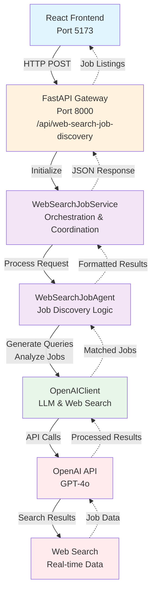

# Job Discovery Service Architecture

## System Overview

The Web Search Job Service is a simplified AI-powered job discovery system that uses OpenAI's web search capabilities to find and match job opportunities for users based on their preferences.

## Architecture Diagram



## Component Details

### 1. Frontend (React + TypeScript)
- **Port**: 5173
- **Framework**: React 18.3 + Vite + TypeScript
- **Service**: `unifiedJobDiscoveryService.ts`
- **Responsibilities**:
  - User interface for job search
  - Display job results
  - Manage user preferences

### 2. API Gateway (FastAPI)
- **Port**: 8000
- **File**: `backend/src/job_automation/infrastructure/api/main.py`
- **Main Endpoint**: `/api/web-search-job-discovery`
- **Responsibilities**:
  - HTTP request handling
  - CORS management
  - Request/response validation
  - Service initialization

### 3. WebSearchJobService
- **File**: `backend/src/job_automation/application/web_search_job_service.py`
- **Responsibilities**:
  - Orchestrate job discovery workflow
  - Handle single/multiple company searches
  - Progress tracking and callbacks
  - Result formatting for frontend compatibility
  - Concurrent request management (semaphore)

### 4. WebSearchJobAgent
- **File**: `backend/src/job_automation/core/agents/web_search_job_agent.py`
- **Responsibilities**:
  - Core job discovery logic
  - Generate targeted search queries
  - Find company careers pages
  - Search for relevant jobs
  - Analyze job-user match scores
  - Sort and filter results

### 5. OpenAIClient
- **File**: `backend/src/job_automation/infrastructure/clients/openai_client.py`
- **Responsibilities**:
  - OpenAI API integration
  - Web search functionality
  - Job analysis and matching
  - Batch request processing
  - Vision capabilities (for future enhancements)

## Data Flow & Input/Output

### Input Structure

```python
# Single Company Request
{
    "company": {
        "name": "Example Corp",
        "website_url": "https://example.com"
    },
    "user_preferences": {
        "skills": ["Python", "React", "TypeScript"],
        "experience_years": 5,
        "experience_level": "senior",
        "desired_roles": ["Software Engineer", "Full Stack Developer"],
        "locations": ["Berlin", "Remote"],
        "job_types": ["remote", "hybrid"],
        "salary_min": 60000,
        "salary_max": 100000,
        "salary_currency": "EUR",
        "industries": ["Technology", "Fintech"],
        "company_size": ["startup", "medium"]
    },
    "max_jobs": 20
}
```

### Processing Steps

1. **Request Reception** (API Gateway)
   - Validate input parameters
   - Initialize progress callback
   - Route to WebSearchJobService

2. **Service Orchestration** (WebSearchJobService)
   - Check OpenAI availability
   - For multiple companies: create semaphore for concurrency control
   - Delegate to WebSearchJobAgent

3. **Job Discovery** (WebSearchJobAgent)
   - **Step 1**: Find careers page
     - Generate search queries
     - Use OpenAI web search to find official careers URL
     - Exclude job boards (LinkedIn, Indeed, etc.)
     - Focus on official company pages or ATS systems (Lever, Greenhouse)
   
   - **Step 2**: Search for jobs
     - Query the careers page for job listings
     - Extract job details (title, location, description, URL)
     - Limit to max_jobs parameter
   
   - **Step 3**: Analyze matches
     - Compare each job with user preferences
     - Calculate match score (0.0 to 1.0)
     - Filter jobs with score > 0.3
     - Sort by match score (descending)

4. **Result Formatting** (WebSearchJobService)
   - Convert to frontend-compatible format
   - Add metadata (execution time, search queries used)
   - Aggregate results for multiple companies

### Output Structure

```python
# Successful Response
{
    "success": true,
    "company": "Example Corp",
    "career_page_url": "https://careers.example.com",
    "total_jobs": 15,
    "matched_jobs": [
        {
            "title": "Senior Software Engineer",
            "description": "Job description snippet...",
            "location": "Berlin, Remote",
            "application_url": "https://careers.example.com/job/123",
            "salary_range": "€70,000 - €90,000",
            "match_score": 0.85,
            "source": "Web Search",
            "posted_date": "2024-01-15",
            "requirements": [],
            "company_name": "Example Corp",
            "match_reasons": [
                "Skills match: Python, React",
                "Location preference: Berlin",
                "Salary in range"
            ]
        }
    ],
    "jobs": [...],  # Same as matched_jobs (for compatibility)
    "agent_system_used": "web_search_agent",
    "execution_time": 3.45,
    "search_queries_used": [
        "Example Corp careers search",
        "site:example.com jobs"
    ]
}

# Error Response
{
    "success": false,
    "error": "No valid careers page found for Example Corp",
    "company": "Example Corp",
    "total_jobs": 0,
    "matched_jobs": []
}
```

## Key Features

### Concurrency Control
- Semaphore limits concurrent company searches (default: 3)
- Prevents API rate limiting
- Improves response times for multiple companies

### Progress Tracking
- Real-time updates via callback function
- Status messages for each processing step
- Error reporting with context

### Fallback Mechanisms
- Mock responses when OpenAI unavailable
- Default search queries if generation fails
- Graceful error handling at each level

### Match Scoring Algorithm
Factors considered:
- Skill overlap
- Location preferences
- Salary range alignment
- Experience level match
- Job type preferences
- Industry alignment

## Configuration

### Environment Variables
```bash
# OpenAI Configuration
OPENAI_API_KEY=sk-...
OPENAI_MODEL=gpt-4o
LLM_TEMPERATURE=0.1
LLM_MAX_TOKENS=4000

# API Configuration
API_HOST=0.0.0.0
API_PORT=8000

# Service Settings
MAX_CONCURRENT_SEARCHES=3
DEFAULT_MAX_JOBS=20
MIN_MATCH_SCORE=0.3
```

### Models & Enums
- **UserPreferences**: User job search criteria
- **JobType**: remote, hybrid, onsite, full-time, part-time, etc.
- **ExperienceLevel**: entry, mid, senior, lead, executive
- **CompanySize**: startup, small, medium, large, enterprise

## Performance Considerations

1. **API Rate Limiting**
   - Concurrent request limiting via semaphore
   - Batch processing for multiple companies
   - Caching potential for repeated searches

2. **Response Times**
   - Single company: ~3-5 seconds
   - Multiple companies: Depends on concurrency settings
   - Timeout handling for long-running requests

3. **Scalability**
   - Stateless service design
   - Horizontal scaling possible
   - Database integration for result caching

## Security Considerations

1. **API Key Management**
   - Environment variable storage
   - Never logged or exposed in responses
   - Validation on startup

2. **Input Validation**
   - Pydantic models for type safety
   - URL validation for company websites
   - Sanitization of user preferences

3. **CORS Configuration**
   - Currently allows all origins (development)
   - Should be restricted in production

## Future Enhancements

1. **Caching Layer**
   - Redis for search result caching
   - TTL-based cache invalidation
   - User-specific cache keys

2. **Advanced Matching**
   - Machine learning for better match scoring
   - Historical data analysis
   - User feedback integration

3. **Additional Data Sources**
   - Direct ATS API integrations
   - RSS feed monitoring
   - Email job alert parsing

4. **Browser Automation Fallback**
   - Playwright for dynamic content
   - JavaScript-rendered job boards
   - CAPTCHA handling