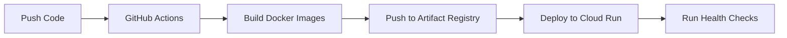

# GCP Deployment Guide for AutoApply

## 📋 Prerequisites

1. **GCP Account**: Create at [console.cloud.google.com](https://console.cloud.google.com)
2. **Tools Required**:
   - gcloud CLI
   - Terraform 1.5+
   - Docker
   - Git

## 🚀 Quick Start

### 1. Initial Setup
```bash
# Make setup script executable
chmod +x deploy/setup-gcp.sh

# Run the setup script
./deploy/setup-gcp.sh
```

This script will:
- Configure your GCP project
- Enable required APIs
- Create service accounts
- Setup Terraform state bucket
- Store secrets in Secret Manager
- Generate terraform.tfvars

### 2. Deploy Infrastructure
```bash
cd terraform

# Review the plan
terraform plan

# Deploy infrastructure
terraform apply

# Note the output URLs
terraform output
```

### 3. Build & Push Docker Images
```bash
# Make script executable
chmod +x deploy/build-and-push.sh

# Build and push all services
./deploy/build-and-push.sh
```

### 4. Deploy Services
Services are automatically deployed via Cloud Run when Docker images are pushed.

## 📁 Project Structure

```
terraform/
├── main.tf                 # Main configuration
├── variables.tf            # Variable definitions
├── terraform.tfvars        # Your configuration (created by setup)
├── backend.tf              # State storage config (created by setup)
└── modules/
    ├── cloud_run/          # Cloud Run services
    ├── database/           # Redis & PostgreSQL
    ├── storage/            # Cloud Storage
    ├── networking/         # VPC & Load Balancer
    ├── secrets/            # Secret Manager
    ├── cloud_tasks/        # Task queues
    ├── iam/                # IAM & Service Accounts
    └── monitoring/         # Logging & Alerts
```

## 🔧 Configuration

### Environment Variables (terraform.tfvars)
```hcl
project_id = "your-project-id"
region     = "us-central1"

# API Keys (stored in Secret Manager)
openai_api_key       = "secret-manager"
supabase_url         = "secret-manager"
supabase_service_key = "secret-manager"

# Scaling
min_instances = 0    # Scale to zero
max_instances = 10   # Cost control

# Database
redis_memory_size = 1  # 1GB Redis
```

## 💰 Cost Optimization

### Estimated Monthly Costs
- **Cloud Run**: ~$50-100 (scales to zero)
- **Redis (1GB)**: ~$35
- **Cloud Storage**: ~$5
- **Load Balancer**: ~$18
- **Total**: ~$108-158/month

### Cost Saving Tips
1. **Scale to Zero**: Services auto-scale down when not in use
2. **Use Spot Instances**: For batch processing
3. **Set Max Instances**: Prevent runaway costs
4. **Monitor Usage**: Setup billing alerts

## 🔐 Security Best Practices

1. **Secrets Management**:
   - All secrets in Secret Manager
   - Never commit secrets to Git
   - Rotate keys regularly

2. **Network Security**:
   - Services in private VPC
   - Cloud NAT for egress
   - IAP for admin access

3. **IAM**:
   - Least privilege principle
   - Service accounts per service
   - Regular audit

## 📊 Monitoring

### Key Metrics
- Cloud Run: Request count, latency, errors
- Redis: Memory usage, connections
- Cloud Tasks: Queue depth, processing time

### Alerts Setup
Alerts are automatically configured for:
- High error rates (>1%)
- High latency (>2s)
- Memory usage (>90%)
- Failed Cloud Tasks

## 🚨 Troubleshooting

### Common Issues

1. **Service won't start**:
```bash
gcloud run services describe job-discovery-api --region=us-central1
gcloud logging read "resource.type=cloud_run_revision"
```

2. **Database connection issues**:
```bash
# Check Redis connection
gcloud redis instances describe autoapply-redis --region=us-central1
```

3. **Secret access issues**:
```bash
# Verify secret exists
gcloud secrets list
gcloud secrets versions list openai-api-key
```

## 🔄 CI/CD Pipeline

### GitHub Actions Setup
1. Add secrets to GitHub repository:
   - `GCP_PROJECT_ID`
   - `GCP_SA_KEY` (contents of terraform-key.json)
   - `OPENAI_API_KEY`
   - `SUPABASE_URL`
   - `SUPABASE_SERVICE_KEY`

2. Pipeline triggers on:
   - Push to main (staging)
   - Push to production (prod)
   - Manual trigger

### Deployment Flow


## 🧹 Cleanup

To destroy all resources:
```bash
cd terraform
terraform destroy

# Also delete the GCS bucket
gsutil rm -r gs://your-project-terraform-state/
```

## 📚 Additional Resources

- [Cloud Run Documentation](https://cloud.google.com/run/docs)
- [Terraform GCP Provider](https://registry.terraform.io/providers/hashicorp/google/latest/docs)
- [GCP Best Practices](https://cloud.google.com/docs/enterprise/best-practices-for-enterprise-organizations)